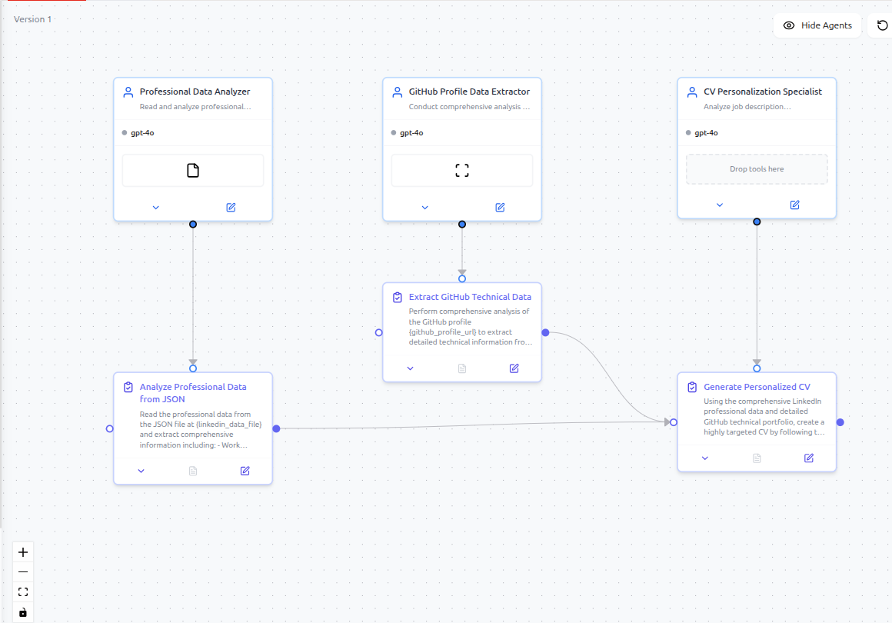
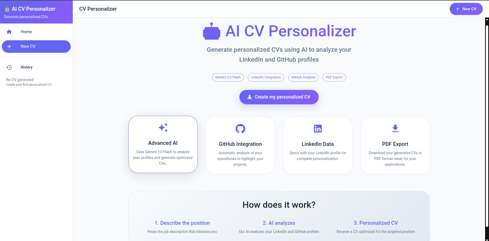
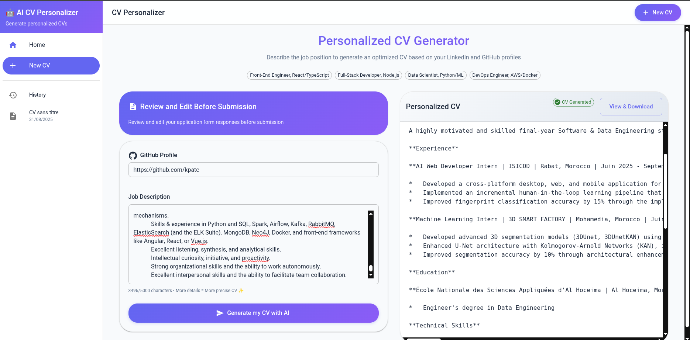

# 🤖 AI CV Personalizer

An intelligent CV personalization tool that leverages AI to analyze your LinkedIn and GitHub profiles, then generates tailored CVs for specific job descriptions.

## ✨ Features

- **🧠 AI-Powered Analysis**: Uses Google Gemini 2.0 Flash for intelligent profile analysis
- **🔗 GitHub Integration**: Analyzes your GitHub repositories and projects
- **💼 LinkedIn Data**: Integrates professional experience from LinkedIn
- **🎯 Job Matching**: Personalizes CV content based on job descriptions
- **📱 Modern Frontend**: React + TypeScript interface with Material-UI
- **📄 PDF Export**: Generate professional PDF CVs
- **📊 Project Selection**: Automatically selects the 3 most relevant projects

## 🏗️ Architecture

### Backend
- **FastAPI**: High-performance API server
- **CrewAI**: Multi-agent AI system for CV generation
- **Google Gemini 2.0 Flash**: Advanced language model
- **GitHub API**: Reliable repository data extraction

### Frontend
- **React + TypeScript**: Type-safe frontend development
- **Material-UI**: Modern component library
- **React Router**: Client-side routing
- **Styled Components**: CSS-in-JS styling

## 🖼️ Crew Agents Architecture

Below is the architecture of the CrewAI agents and their connections:



## 🚀 Quick Start

### 1. Gemini API Configuration
```bash
# Copy your API key to backend/.env
cd backend
echo "GOOGLE_API_KEY=your_api_key_here" > .env
```

### 2. Launch (2 terminals)

**Terminal 1 - Backend:**
```bash
cd backend
uv run uvicorn main:app --reload
# API on http://localhost:8000
```

**Terminal 2 - Frontend:**
```bash
cd frontend  
npm start
# Interface on http://localhost:3000
```

## 🎨 User Interface

- **Input Area**: Job description on the left
- **CV Display**: Personalized result on the right  
- **History Sidebar**: All your conversations
- **Downloads**: Integrated export buttons

## 🖼️ Frontend Screenshots

Below are screenshots showing the main interface of the AI CV Personalizer frontend:

### Main Generator Page


### CV Display Page


## 🔧 Technologies

- **Frontend**: React 18, Tailwind CSS, Axios, React-Markdown
- **Backend**: FastAPI, Uvicorn, Pydantic
- **AI**: CrewAI, Google Gemini 2.0 Flash
- **Storage**: File system (extensible to DB)

## 🎯 Upcoming Features

- [ ] Persistent database
- [ ] User authentication
- [ ] Multiple CV templates
- [ ] PDF export
- [ ] Compatibility analysis
- [ ] Improvement suggestions

---

**Developed with ❤️ by the AI CV Personalizer team**


